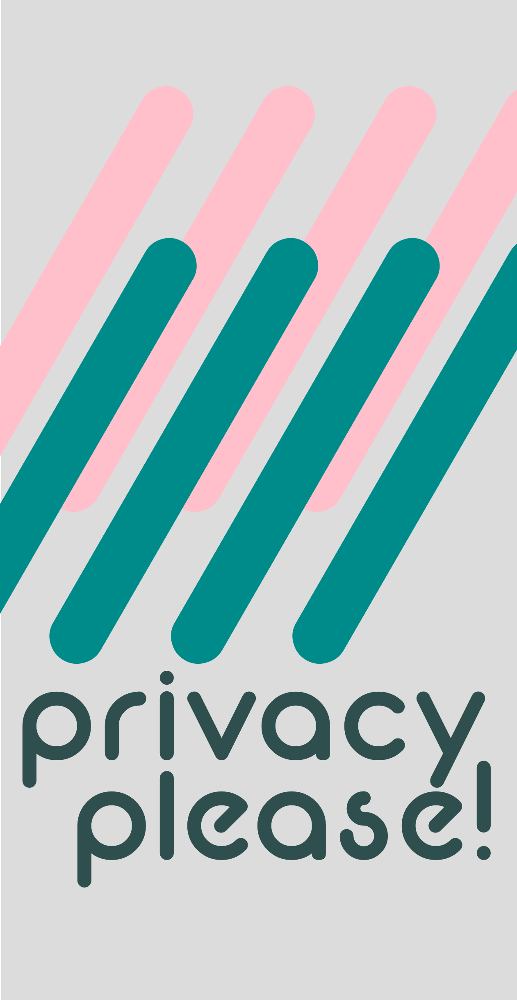
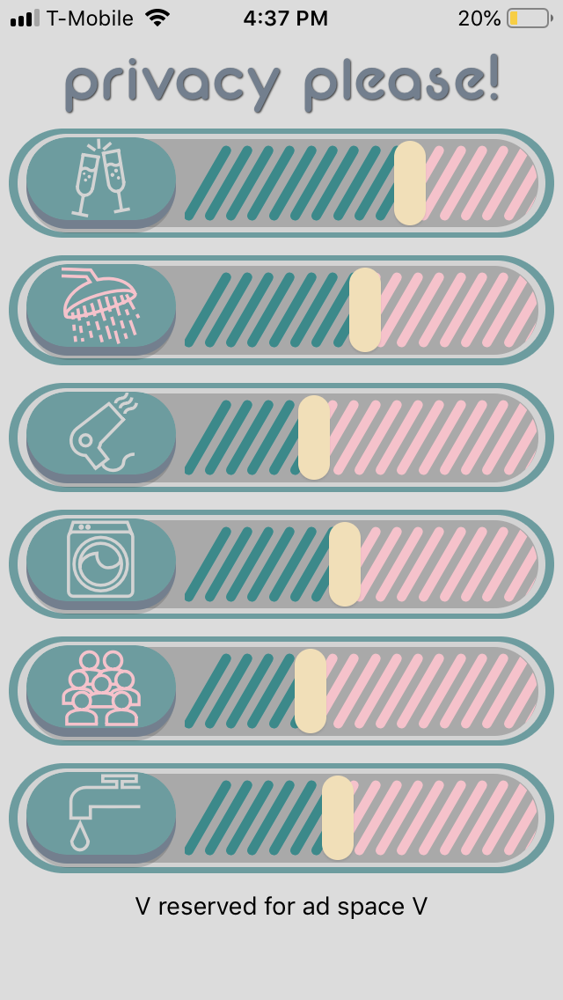

# _Privacy Please_

_iOS mobile app to create a noise barrier to mask speech or other audio in your immediate surroundings._

## Setup

- Download the expo app on your iOS device.
- `npm i` and `expo start` in terminal.
- Scan QR code with your iOS device to launch app on device.

## WIP Screenshot  

## Demo GIF

- coming soon!

## Dependencies

*"expo": "^34.0.1",*  
*"expo-av": "^6.0.0",*  
*"react": "16.8.3",*  
*"react-dom": "^16.8.6",*  
*"react-native": "https://github.com/expo/react-native/archive/sdk-34.0.0.tar.gz",*  
*"react-native-web": "^0.11.4"*  

## TODOs

[x] change font  
[] splash screen  
[] app icon  
[x] animated buttons  
[x] custom slider graphics  
[x] source audio  
[x] button icons  
[x] refine colors  
[] hide curser at max  
[] optimize for iPhone+  
stretch:  
[] more module changes upon activation  
 